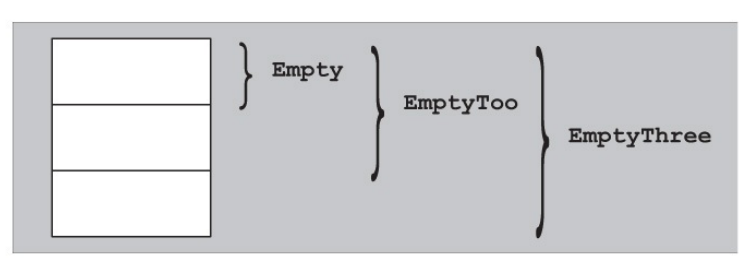
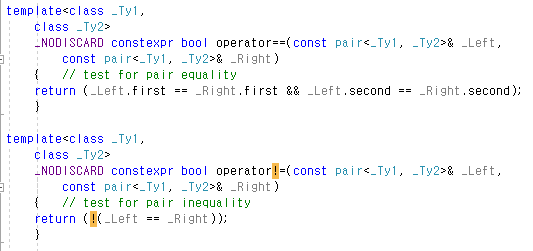
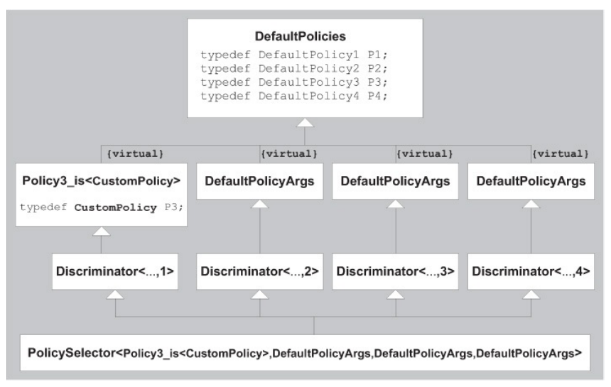

# Chapter 21. Templates and Inheritance 

배우기 전에는, 템플릿과 상속이 흥미로운 방식으로 상호작용 한다고 생각할 이유가 없을 수도 있습니다. 무엇보다도 우리는 13장에서 종속 기본 클래스로부커 파생된다는 사실이 우리에게 부적합한 이름을 주의깊게 다룰 것을 요구한다. 그러나 Curiously Recurring Template Pattern(CRTP)과 mixins을 포함한 몇가지 흥미로운 기술이 이 두가지 기능을 결합시킨것으로 나타났다. 이 장에서는 이러한 기술 중 몇가지를 설명한다.


## 21.1 The Empty Base Class Optimization (EBCO) 

C++클래스는 종종 비어있다. 이 말은 런타임때 메모리를 필요로 하지 않는다는 얘기이다. 일반적으로 클래스가 type 멤버만 가지거나, nonvirtual 함수만 가지거나 아니면 static data멤버만 가지는 클래스는 런타임때 메모리가 필요하지 않는다. 반면에 nonstatic data member, virtual 함수, virtual base class는 런타임시 약간의 메모리가 필요하다.

그러나 empty클래스도 크기가 0은 아니다.

```c++
#include <iostream>

class EmptyClass {
    
};

int main()
{
    std::cout << "sizeof(EmptyClass): " << sizeof(EmptyClass) << '\n';
}
```

많은 플랫폼에서 실행하면 EmptyClass의 사이즈는 1일것이다. 소수의 시스템에서 보다 엄격한 정렬을 하기 때문에 integer로 표현하는 경우도 있다.


### 21.1.1 Layout Principles 

C++ 설계자는 다양한 이유로 zero-size클래스를 피하고 싶을 수 있다. 예를 들어, zero-size클래스의 배열은 아마도 크기가 0이지만 포인터 연산의 일반적인 특성은 더이상 적용되지 않는다. 예를들어 ZeroSizedT가 zero-size타입이라고 가정해보자.

```c++
ZeroSizedT z[10];
...
&z[i] - &z[j]		// compute distance between pointers/address
```

이전 예제와의 차이점은 두 주소사이의 바이트 수를 가리키는 유형의 크기로 나눈 값이지만 크기가 0일때는 만족스럽지 않다.

그러나 C++에 zero-size 타입이 없더라도 C++표준에 빈 클래스가 베이스 클래스로 사용될 때 동일한 유형의 다른 객체 또는 하위 객체와 동일한 주소에 할당을 제공하지 않는다면 공간을 할당할 필요가 없다. Empty Base Class Object(EBCO)가 실제로 무엇을 의미하는지 명확히 하기 위해 몇가지 예를 살펴보자.

```c++
#include <iostream>

class Empty{
    using Int = int;		// type alias members don't make a class nonempty
};

class EmptyToo : public Empty {
    
};

class EmptyThree : public EmptyToo {
    
};

int main()
{
    std::cout << "sizeof(Empty):		" << sizeof(Empty) << '\n';
    std::cout << "sizeof(EmptyToo):		" << sizeof(EmptyToo) << '\n';
    std::cout << "sizeof(EmptyThree):	" << sizeof(EmptyThree) << '\n';
}
```

이 프로그램을 실행하면 모든 클래스에 동일한 크기가 인쇄되지만 크기가 0인 클래스는 없다. 


 즉 EmptyToo클래스 내에서 Empty클래스에는 공백이 없다. 또한 최적화된 empty클래스 (그리고 다른 베이스 클래스가 없는) 도 비어있다는 사실에 유의해야한다. 이것은 EmptyThree클래스가 Empt클래스와 사이즈가 같은 이유를 설명한다. 컴파일러가 EBCO(Empty Base Class Object)를 구현하지 않으면 다양한 크기로 출력된다.



```c++
#include <iostream>

class Empty {
    using Int = int;		// type alias members don't make a class nonempty
};

class EmptyToo : public Empty {
    
};

class NonEmpty : public Empty, public EmptyToo {
    
};

int main() 
{
    std::cout << "sizeof(Empty): 		" << sizeof(Empty) << '\n';
    std::cout << "sizeof(EmptyToo): 	" << sizeof(EmptyToo) << '\n';
    std::cout << "sizeof(NonEmpty):		" << sizeof(NonEmpty) << '\n';
}
```

NonEmpty클래스가 빈 클래스가 아니라는건 놀랍지 않다. 어쨌든 멤버가 없고 기본 클래스도 수행하지 않는다. 그러나 NonEmpty의 기본클래스 Empty와 EmptyToo는 같은 주소값에 할당 될 수 없다. 이는 EmptyToo의 기본클래스 Empty가 클래스 NonEmpty의 기본 클래스 Empty와 동일한 주소로 끝나기 때문이다.


EBCO(Empty Base Class Object)의 제한에 대한 이론적 근거는 두 포인터가 같은 객체를 가리키는지 비교할 수 있다. 포인터는 항상 내부적으로 주소로 표현되기 때문에 두개의 서로 다른 주소(포인터값)가 서로 다른 두 객체에 해당하는지 확인해야 한다. 

클래스의 두 하위 객체가 동일한 완전한 객체에서 사용될 때 최적화가 금지된다. 이 제약조건이 있더라도. EBCO는 템플릿에 대한 중요한 최적화다. 라이브러리는 새로운 type aliases를 사용하거나 새로운 데이터를 추가하지 않고 추가 기능을 제공하기 위한 용도로만 기본 클래스를 사용하기 때문에 여러가지 추가 기술이 필요하다.


### 21.1.2 Members as Base Classes

The EBCO has no equivalent for data members because(among other things) it would create some problems with the representation of pointers to member. As a result, it is sometimes desirable to implement as a (private) base class what would at first sight be thought of as a member variable.

문제는 templates의 문맥에서 가장 흥미롭다. 왜냐하면 Template parameters는 종종 empty class type으로 대체되지만 일반적으로는 이 규칙에 의존할 수 없다. template type parameters에 대해 알려진게 없으면 EBCO를 쉽게 사용할 수 없다.

```c++
template<typename T1, typename T2>
class MyClass {
private:
	T1 a;
    T2 b;
    ...
};
```

It is entirely possible that one or both template parameters are substituted by an empty class type. If this is the case, then the representation of MyClass<T1, T2> may be suboptimal and may waste a word of memory for every instance of a MyClass<T1, T2>

```c++
template<typename T1, typename T2>
class MyClass : private T1, private T2 {
    
};
```

대신에 템플릿 매개변수를 기본 클래스로 만들면 문제를 피할 수 있습니다.

그러나 이 방식에는 다음과 같은 문제가 있다

* T1또는 T2가 nonclass type또는 union type인 경우에는 작동하지 않는다.
* 또 두 매개변수가 같은 유형으로 대체된 경우에도 작동하지 않는다.
* Final클래스를 상속시도 할 경우 오류가 발생한다.

이러한 문제를 만족스럽게 해결했다고 해도 매우 심각한 문제가 계속된다. 기본 클래스를 추가하면 해당클래스의 인터페이스를 수정할수 있는데 MyClass의 경우에는 영향을 줄 인터페이스 요소가 별로 없어서 중요하지는 않겠지만 뒤에서 설명할 템플릿 매개변수를 상속하면 멤버변수의 가상함수 여부가 달라질 수 있다. EBCO를 이용하는 이 접근법은 모든 부분의 문제로 어려움을 겪고 있다.

템플릿 매개변수가 class type일 경우에만 대체될수 있고 클래스 template의 다른 멤버가 사용가능할때 실용적으로 사용할수 있다고 알려져 있다. 주요 아이디어는 EBCO를 사용해서 잠제적으로 empty type 매개변수를 다른 멤버와 병합하는것이다. 

```c++
template<typename CustomClass>
class Optimizable {
private:
	CustomClass info;			// might be empty
	void* 		storage;
	...
};
```

```c++
template<typename CustomClass>
class Optimizable {
private:
	BaseMemberPair<CustomClass, void*> info_and_storage;
};
```

이렇게 하면 기존 코드보다 구현을 복잡하게 만든다. 그러나 다양한 템플릿 라이브러리 구현자들은 라이브러리의 클라이언트에 대한 성능향상이 추가된 복잡성을 정당화 한다고 한다. 이 말은 뒤에 tuple에서 더 자세히 살펴본다.


**basememberpair.hpp**

```c++
#ifndef BASE_MEMBER_PAIR_HPP
#define BASE_MEMBER_PAIR_HPP

template<typename Base, typename Member>
class BaseMemberPair : private Base {
private:
	Member mem;
public:
	// constructor
    BaseMemberPair(Base const& b, Member const& m) : Base(b), mem(m) {
    }
    
    // access base class data via first()
    Base const& base() const {
    return static_cast<Base const&>(*this);
    }
    Base& base() {
    	return static_cast<Base&>(*this);
    }
    
    // access member data via second()
    Member const& member() const {
    	return this->mem;
    }
    Member& member() {
    	return this->mem;
    }
};

#endif
```

구현시 캡슐화된 데이터멤버에 접근하려면 멤버함수 base() 및 member()를 사용해야 한다.


## 21.2 The Curiously Recurring Template Pattern (CRTP) 

다른 패턴은 Curiously Recurring Template Pattern(CRTP)이다. 이 이상한 이름의 템플릿은 파생 클래스를 템플릿 인수로 상속받은 템플릿 클래스중 하나에 전달하는 클래스의 기술을 나타낸다. 

```c++
tymplate<typename Drived>
class CuriousBase {
    ...
};

class Curious : public CuriousBase<Curious> {
    ...
};
```

Curiously Recurring Template Pattern (CRTP)의 첫번째 예시는 비 종속 기본 클래스를 보여준다. Curious클래스는 템플릿이 아니므로 종속 기본 클래스의 이름 가시성 문제에서 영향을 받지 않는다. 그러나 이것은 CRTP의 본질적인 특성은 아니다.

```c++
template<typename Derived>
class CuriousBase {
    ...
};

template<typename T>
class CuriousTemplate : public CuriousBase<CuriousTemplate<T>> {
    ...
};
```

파생 클래스를 템플릿 매개 변수를 통해 기본 클래스로 전달함으로써 기본 클래스는 가상함수를 사용하지 않고도 파생클래스에 대한 고유한 동작을 정의할수 있다. 이로인해 CRTP는 멤버함수 이거나 파생클래스의 ID에 종속적인 구현을 제외하는데 유용하다.

간단한 CRTP 프로그램은 특정 클래스 유형의 객체수를 추적하여 유지하는것으로 구성된다. 이는 모든 생성장에서 정수 데이터 멤버를 증가시키고 소멸자에서 감소시키는 방법으로 쉽게 수행할 수 있다. 그러나 모든 클래스에서 이러한 코드를 제공하는 것은 지루하고 한개의 기본 클래스(CRTP가 아닌 클래스)를 통해 기능을 구현하면 여러 파생 클래스에 대한 개체수의 혼동을 초래할 수 있다. 

**objectcounter.hpp**

```c++
#include <cstddef>

template<typename CountedType>
class ObjectCounter {
private:
	inline static std::size_t count = 0;		// number of existing objects
	
protected:
	// default constructor
	ObjectCounter() {
        ++count;
	}
	
	// copy constructor
	ObjectCounter(ObjectCounter<CountedType> const&) {
        ++count;
	}
	
	// move constructor
	ObjectCounter (ObjectCounter<CountedType) && {
        ++count;
	}
	
	// destructor
	~ObjectCounter() {
        --count;
	}
	
public :
	// return number of existing objects:
	static std::size_t live() {
        return count;
	}
};
```

inline을 사용하여 클래스 구조 내에서 count멤버를 정의하고 초기화 할 수 있다. c++17 이전에는 클래스 템플릿 외부에서 정의해야 했다.

```c++
template<typename CountedType>
class ObjectCounter {
private:
	static std::size_t count;	 	// number of existing objects
	...
};

//initialize counter with zero:
template<typename CountedType>
std::size_t ObjectCounter<CountedType>::count = 0;
```

특정 클래스 유형에 대한 아직 파괴되지 않은 객체의 수를 계산하려면 ObjectCounter템플릿에서 클래스를 상속받으면 된다.

```c++
#include "objectcounter.hpp"
#include <iostream>

template<typename CharT>
class MyString : public ObjectCounter<MyString<CharT>> {
	...
};

int main()
{
    MyString<char> s1, s2;
    MyString<wchar_t> ws;
    
    std::cout << "num of MyString<char>: 	"
        	  << MyString<char>::live() << '\n';
    std::cout << "num of MyString<wchar_t>: 	"
        	  << ws.live() << '\n';
}
```


### 21.2.1 The Barton-Nackman Trick 

1994년 John J. Barton과 Lee R. Nackman은 제한된 템플릿 확장 이라고 하는 템플릿 기술을 발표했다. 이 기술은 함수템플릿의 오버로딩은 심각하게 제한되어있고 대부분의 컴파일러에서 네임스페이스를 사용할수 없는 점에서 동기를 주었다.

operator==를 정의해야하는 Array 템플릿이 있다고 가정하자. 한가지 가능성은 연산자를 클래스 멤버로 선언하는것이지만, 첫번째 매개변수가 두번째 인수와 다른 변환 규칙의 영향을 받기 때문에 이는 바람직 하지 않다. operator==은 매개변수에 대해 대칭을 의미하므로 네임스페이스 범위 함수로 선언하는것이 좋다.

```c++
template<typename T>
class Array {
public:
    ...
};

template<typename T>
bool operator== (Array<T> const& a, Array<T> const& b)
{
    ...
}
```

그러나 만약에 함수템플릿을 오버로드 할수 없으면 이 문법은 문제가 있다. 다른 operator==이 없으면 이 범위에 선언할수 있지만 다른 클래스 템플릿에서 이 템플릿이 필요할 수 있다. Barton and Nackman은 operator의 선언 문제를 일반적인 [friend function]("https://msdn.microsoft.com/ko-kr/library/465sdshe.aspx")로 정의해서 문제를 해결했다.

```c++
template<typename T>
class Array {
    static bool areEqual(Array<T> const& a, Array<T> const& b);
    
public:
	friend bool operator== (Array<T> const& a, Array<T> const& b) {
        return areEqual(a, b);
	}
};
```

Array가 float유형으로 인스턴스화 했다고 가정하자. Friend operator 함수는 인스턴스화의 결과로 선언되지만, 이 함수 자체는 함수템플릿의 인스턴스화가 아니다. 인스턴스화 프로세스의 부작용으로 전역범위에 주입되는 일반적인 비 템플릿 함수이다. 이것은 템플릿이 아닌 함수이기 때문에 함수템플릿의 오버로드가 언어에 추가되기 전에 operator==의 다른 선언으로 오버로드 될수 있다. Barton and Nackman은 모든 유형 T에 적용되는 템플릿 operator==(T, T)의 사용을 피하기 위해 이 제한된 템플릿 확장을 호출했다.

```
operator== (Array<T> const&, Array<T> const&)
```

friend함수 정의에 대한 이름 검색은 1994년부터 바뀌었으므로  Barton-Nackman의 속임수는 더이상 c++표준에서 유용하지 않다. 발명당시, friend선언은 템플릿이 인스턴스화 될때 클레스 템플릿의 범위에서 볼 수 있다. 표준 c++은 그 방법 대신 인수 종속적인 조회를 통해 친구 함수 선언을 찾는다(220페이지 13.2.2 참조). 즉 함수 호출의 인수중에 적어도 하나는 friend 함수가 포함된 클래스가 관련 클래스로 있어야 한다. 인수가 friend를 가지고 있는 클래스로 변환할수 있는 관계가 없는 클래스라면  friend 함수를 찾을 수 없다.

```c++
class S {};

template<typename T>
class Wrapper {
private:
	T object;
public:
	Wrapper(T obj) : object(obj) {
        // implicit conversion from T to Wrapper<T>
	}
	friend void foo(Wrapper<T> const&) {
        
	}
};

int main()
{
	S s;
	Wrapper<S> w(s);
	foo(w);			// OK: Wrapper<S> is a class associated with w 
	foo(s);			// ERROR: Wrapper<S> is not associated with s
}
```

여기서 foo ()는 foo () 함수가 w2 인자와 관련된 클래스 인 Wrapper \<S>에서 선언 된 친구이기 때문에 유효합니다. type S가  Wrapper\<S>의 생성자를 통해 유효한 암시적 변환이 있더라도 이 변환은 처음부터 발견되지 않기 때문에 변환이 고려되지 않는다. 

Morden C++에서는, 템플릿 클래스에서 friend 함수를 정의하는것의 유일한 장점은 문법적 장점 뿐이다. (클래스를 둘러싸고 있는 범위에 관계없이 private멤버와 protected멤버에 접근할수 있는 것) 그러나 friend함수 정의는 CRTP와 결합됐을때 유용하게 사용할 수 있다.


###21.2.2 Operator Implementations

오버로드 된 연산자를 제공하는 클래스를 구현할때 여러 다른 연산자에 오버로드를 구현하는 것이 일반적이다. 예를들면 operator==을 구현하는 클래스는 operator!=나 operator>를 구현할 것이다. 대부분의 경우 단 한개의 연산자를 구현하는것은 흥미롭고  다른 연산자는 해당 연산자에 따라 간단히 정의할 수 있다.

```c++
bool operator!= (X const& x1, X const& x2)
{
    return !(x1 == x2);
}
```

많은 연산자중에 operator!=와 비슷한 연산이 있으면 이것을 템플릿화 하고 싶은 유혹을 느낀다. 

```c++
template<typename T>
bool operator!= (T const& x1, T xonst& x2)
{
    return !(x1 == x2);
}
```

실제로 c++STL <utility>헤더에 이러한 정의가 포함되어 있다.



그러나 이러한 정의(!=, >, <=, >=)는 std에서 사용할수 있게 되었을때 문제가 발생했다고 판단되면 표준화 중에 [std::rel_ops]("std::rel_ops")의 연산자로 변경되었다. 

실제로 이러한 정의를 볼수 있게 되면 모든 유형에 operator!=(인스턴스화에 실패 할 수 있음)연산자가 나타나게되고 연산 결과는 항상 정확히 일치한다. 첫번째의 문제, operator!=가 적절한 operator==가 있는 경우에만 인스턴스화 되는 문제는 SFINAE기술로 해결할수 있다. 두번째의 문제, derived-to-base 변환같은 일을 할때 일반적인 operator!= 정의는 사용자가 만든 정의보다 우선하게 된다.

CRTP를 기반으로 한 이러한 연산자 템플릿의 다른 공식을 사용하면 클래스가 일반 연산자 정의에 동의할수 있으므로 지나친 일반적인 연산자의 부작용 없이 코드 재사용의 이점을 얻을수 있다.

```c++
template<typename Derived>
class EqualityComparable
{
public:
	friend bool operator!= (Derived const& x1, Drived const& x2)
	{
        return !(x1 == x2);
	}
};

class X : public EqualityComparable<X>
{
public:
	friend bool operator== (X const& x1, X const& x2) {
        // implement logic for comparing two objects of type X
	}
};

int main()
{
    X x1, x2;
    if(x1 != x2) { }
}
```

EqualityComparable<> 는 CRTP를 사용하여 파생클래스에 대해 operator==의 파생클래스 정의에 따라 operator!=를 제공한다. 이것은 friend 함수 정의(Barton-Nackman trick)를 통해 실제의 정의를 제공한다. 이 정의는 두 매개변수가 operator!=와 같은 동작을 하게 해준다.

CRTP는 기본 파생 클래스의형태를 유지하면서 기본 클래스에 동작을 분해할때 유용하게 사용할수 있다. Barton-Nackman trick과 함께 CRTP는 몇가지 표준 연산자를 기반으로 하는 수많은 연산자에 대한 일반적인 정의를 제공할 수 있다. 

### 21.2.3 Facades 

[퍼사드]("https://ko.wikipedia.org/wiki/%ED%8D%BC%EC%82%AC%EB%93%9C_%ED%8C%A8%ED%84%B4")는 클래스 라이브러리 같은 어떤 소프트웨어의 다른 커다란 코드 부분에 대한 간략화된 인터페이스를 제공하는 객체이다.

- 퍼사드는 소프트웨어 라이브러리를 쉽게 사용할 수 있게 해준다. 또한 퍼사드는 소프트웨어 라이브러리를 쉽게 이해할 수 있게 해 준다. 퍼사드는 공통적인 작업에 대해 간편한 메소드들을 제공해준다.
- 퍼사드는 라이브러리를 사용하는 코드들을 좀 더 읽기 쉽게 해준다.
- 퍼사드는 라이브러리 바깥쪽의 코드가 라이브러리의 안쪽 코드에 의존하는 일을 감소시켜준다. 대부분의 바깥쪽의 코드가 퍼사드를 이용하기 때문에 시스템을 개발하는 데 있어 유연성이 향상된다.
- 퍼사드는 좋게 작성되지 않은 API의 집합을 하나의 좋게 작성된 API로 감싸준다.

이 패턴을 기존 인터페이스(numeric type, iterator, constainer)등의 요구사항을 충족시켜야 하는 새로운 type을 정의할 떄 특히 유용하다

퍼사드 패턴을 설명하기 위해 반족자를 위한 퍼사드를 구연하고 이는 표준라이브러리의 요구사항을 따르는 반복자를 작성하는 프로세스를 대폭 간소화한다. iterator(특히 random access iterator)에 필요한 인터페이는 꽤 크다.

```c++
template<typename Derived, typename Value, typename Category, typename Reference = Value&, typename Distance = std::ptrdiff_t>
class IteratorFacade
{
public:
	using value_type = typename std::remove_const<Value>::type;
	using reference = Reference;
    using pointer = Value*;
    using difference_type = Distance;
    using iterator_category = Category;
    
    // input iterator interface:
    reference operator *() const {...}
    pointer operator ->() const {...}
    Derived& operator ++() {...}
    Derived operator ++(int) {...}
    friend bool operator== (IteratorFacade const& lhs, Iterator Facade const& rhs) {...}
    
    // bidirectional iterator interface:
    Derived& operator --() {...}
    Derived oprator --(int) {...}
    
    //random access iterator interface:
    reference operator [](difference_type n) const {...}
    Derived& operator +=(difference_type n) {...}
    
    friend difference_type operator -(IteratorFacade const& lhs, IteratorFacade const& rhs) {...}
    friend bool operator <(IteratorFacade const& lhs, IteratorFacade const& rhs) {...}
};
```

간결성을 위해 몇가지 선언을 생략했지만 모든 새로운 iterator에 대해 나열된 모든 것을 구현하는것도 상당히 어렵다. 다행히도 이 인터페이스는 다음과 같은 몇가지 핵심 작업으로 분류될 수 있다.

* For all iterators:
  * deference(): iterator가 참조하는 값에 접근한다. (일반적으로 operator* 나 operator->를 통해 사용된다)
  * increment(): iterator를 이동하여 시퀀스의 다음 항목을 참조한다.
  * equals(): 두개의 iterator가 시퀀스의 동일한 항목을 참조하는지 여부를 결정한다.
* For bidirectional iterators:
  * decrement(): iterator를 이동하여 시퀀스의 이전 항목을 참조한다.
* For random-access iterators:
  * advance(): iterator를 n개 앞으로 혹은 뒤로 이동한다.
  * measureDistance(): 다른 시퀀스까지 이동할 단개수를 결정한다.

퍼사드의 역할은 완전한 iterator인터페이스를 제공하기 위해 핵심 연산만을 구현하는 유형을 채택하는것이다. IteratorFacades는 대부분 iterator구문을 최소 interface에 매핑하는것과 관련이 있다. 

```c++
Derived& as Derived() { return *static_cast<Derived*>(this); }
Derived const& asDerived() const {
    return *static_cast<Derived const*>(this);
}
```

이 정의를 감안할 때, 대부분의 외관 구현은 간단하다. 

```c++
reference operator*() const {
    return asDerived().dereference();
}

Derived& Operator++() {
    asDerived().increment();
    return asDerived();
}

Derived operator++(int) {
    Derived result(asDerived());
    asDerived(). increment();
    return result;
}

friend bool operator== (IteratorFacade const& lhs, IteratorFacade const& rhs) {
    return lhs.asDerived().equals(rhs.asDerived());
}
```

**Defining a Linked-List Iterator**

IteratorFacade에 대한 정의로 이제 iterator를 간단한 linked-list클래스로 쉽게 정의할수 있다.

```c++
template<typename T>
class ListNode {
public:
	T value;
	ListNode<T>* next = nullptr;
	~ListNode() { delete next; }
};
```

IteratorFacade를 사용하면 이러한 목록에 대한 iterator를 간단하게 정의할수 있다.

```c++
template<typename T>
class ListNodeIterator 
    : public IteratorFacade<ListNodeIterator<T>, T, std::forward_iterator_tag> 
{
	ListNode<T>* current = nullptr;
public:
    T& dereference() const {
    	return current->value;
    }
    void increment() {
    	current = current->next;
    }
    bool equals(ListNodeIterator const& other) const {
    	return current == other.current;
    }
    ListNodeIterator(ListNode<T>* current = nullptr) : current(current) { }
};
```

ListNodeIterator는 forward iterator로써 기능하는데 필요한 모든 올바른 연산자와 중첩된 유형을 제공하며 구현하는데 필요한 코드가 많지 않다. 뒤에 나올 보다 복잡한 반복자(random access iterator같은)를 정의할때도 적은양의 추가작업만 필요하다.

**Hiding the interface**

ListNodeIterator를 구현할 떄 한가지 단점은 public 인터페이스로 dereference(), advance(), equals()작업을 노출해야 한다는 것이다. 이 요구사항을 제거하기 위해 IteratorFacade를 별도의 접근 클래스(IteratorFacadeAccess)를 통해 파생된 CRTP클래스에서 모든 작업을 수행하도록 재작업 하자. 

```c++
// 'friend' this class to allow IteratorFacade access to core iterator operations:
class IteratorFacadeAccess
{
    // only IteratorFacade can use these definitions
    template<typename Dericed, typename Value, typename Category, typename Reference, typename Distance>
    friend class IteratorFacade;
    
    // required of all iterator:
    template<typename Reference, typename Iterator>
    static Reference dereference(Iterator const& i) {
        return i.dereference();
    }
    
    // require of bidirectional iterators:
    template<typename Iterator>
    static void decrement(Iterator& i) {
        return i.decrement();
    } 
    
    // require of random-access iterators:
    template<typename Iterator, typename Distance>
    static void advance(Iterator& i, Distance n) {
        return i.advance(n);
    }
};
```

이 클래슨는 제공된 iterator의 해당 비 정적 멤버 함수를 호출하여 각 핵심 iterator 연산에 대한 정적 멤버 함수를 제공한다. 모든 정적 멤버함수는 private이며 IteratorFacade 자체에만 접근 권한이 부여된다. 따라서 ListNodeIterator는 IteratorFacadeAccess를 친구로 만들고 외관에 필요한 인터페이스를 비공개로 유지할 수 있다.

```c++
template<typename T>
class ListNodeIterator 
    : public IteratorFacade<ListNodeIterator<T>, T, std::forward_iterator_tag> 
{
	ListNode<T>* current = nullptr;
	friend classs IteratorFacadeAccess;
	
    ListNodeIterator(ListNode<T>* current = nullptr) : current(current) { }
};
```

**Iterator Adapters**

Our IteratorFacade makes it easy to build an iterator adapter that takes an existing iterator and exposes a new iterator that provides some transformed view of the underlying sequence.

```c++
struct person {
    std::string firstName;
    std::string lastName;
    
    friend std::ostream& opteratr<<(std::ostream& strm, Person const& p) {
        return strm << p.lastName << ", " << p.firstName;
    }
};
```

그러나 컨테이너의 모든 Person값을 반복하는 것이 아니라 firstName만 보고 싶을때는 어떻게 해야 하는가? 이럴때는 기본 iterator의 값을 Person::firstName과 같은 일부 포인터 데이터로 "project"할수 있게 해주는 ProjectionIterator라는 iterator adapter를 만들어보자.

```c++
template<typename Iterator, typename T>
class ProjectionIteator : public IteratorFacade<
    						ProjectionIterator<Iterator, T>,
							T,
							typename std::iterator_traits<Iterator>::iterator_category,
							T&,
							typename std::iterator_traits<Iterator>::difference_type>
{
	using Base = typename std::iterator_traits<Iterator>::value_type;
	using Distance = typename std::iterator_traits<Iterator>::difference_type;
	
	Iterator iter;
	T Base::* member;
	
	friend class IteratorFacadeAccess;
	... // implement core iterator operations for Iterator Facade
	
public:
	ProjectionIterator(Iterator iter, T Base::* member) : iter(iter), member(member) { }
};

template<typename Iterator, typename Base, typename T>
auto project(Iterator iter, T Base::* member) {
    return ProjectionIterator<Iterator, T>(iter, member);
}
```

Projection iterator는 두가지 값을 저장한다.

* Iter: base 값, 기본 시퀀스에 대한 iterator
* member: 데이터멤버로 변환할 포인터

이를 염두해 두고 IteratorFacade기본 클래스에 제공된 템플릿 매개변수를 고려한다. 첫번째는 ProjectionIterator자체이다.(CRTP를 사용하기 위한) 두번째 T와 네번째 T& 매개변수는 projection iterator의 값 및 참조 유형이며 이를 T값의 시퀀스로 정의한다. 세번째와 다섯번째 매개변수는 기본 iterator의 카테고리와 difference type유형을 전달하기만 한다. 따라서 projection iterator는 Iterator가 Input Iterator일때는 Input Iterator가 되고, bidirectional Iterator일때는 bidirectional Iterator가 되고, random access Iterator일때는 random access Iterator가 된다. project()함수를 사용하면 projection iterator를 쉽게 만들수 있다.

누락된 유일한 부분은 IteratorFacade의 핵심 요구사항을 구현하는것이다. 가장 흥미로운 부분은 dereference()이다. 이 함수는 기본 iterator를 역 참조 한 다음 포인터를 데이터멤버로 변환한다.

```c++
T& dereference() const {
    return (*iter).*member;
}
```

이외에 나머지 작업은 기본 iterator로 구현된다.

```c++
void increment() {
    ++iter;
}

bool equals(ProjectionIterator const& other) const {
    return iter == other.iter;
}

void decrement() {
    --iter;
}
```

```c++
#include <algorithm>
#include <iterator>

int main()
{
    std::vector<Person> authors = { {"David", "Vandevoorde"},
                                   	{"Nicolai", "Josuttis"},
                                   	{"Douglas", "Gregor"} };
    
    std::copy(project(authors.begin(), &Person::firstName),
             project(authors.end(), &Person::firstName),
             std::ostream_iterator<std::string>(std::cout, "\n"));
}
```

facad패턴은 특정 인터페이스를 준수하는 새로운 유형을 생성하는데 특히 유횽하다. 새로운 유형은 일부 반복되는 핵심 작업(iterator facade의 경우 3~6개)만 외부에 노출해야 하고  CRTP와 Barton-Anckman 트릭의 조합을 사용하여 완전하고 정확한 공용 Interface를 제공한다.


## 21.3 Mixins 

```c++
class Point 
{
public:
	double x, y;
	Point() : x(0.0), y(0.0) { }
	Point(double x,, double y) : x(x), y(y) { }
};

class Polygon
{
private:
	std::vector<Point> points;
public:
	... // public operations
};
```

이 Polygon 클래스는 사용자가 각 포인트와 연관된 정보 세트를 확장하여 각 포인트의 색상과 같은 응용 프로그램 특정 데이터를 포함하거나 각 포인트에 레이블을 연관시킬 수있는 경우에 더 유용하다. 이 확장을 가능하게하는 한 가지 옵션은 점의 유형에 따라 다각형을 매개 변수화하는 것이다.

```c++
template<typename P>
class Polygon
{
private:
    std::.vector<P> points;
public:
	... // public operations
};
```

Point와 동일한 인터페이스를 제공하지만 상속을 사용하여 다른 응용 프로그램 관련 데이터를 포함하는 자체 Point-like 데이터 형식을 만들 수 있다.

```c++
class LabeledPoint : public Point
{
public:
	std::string label;
	LabeledPoint() : Point(), label("") { }
	LabeledPoint(double x, double y) : Point(x, y), label("") { }
};
```

이 구현에는 단점이 있다. 하나는 Point를 상속받을수 있도록 Point유형을 노출해야 한다. 또한 LabeledPoint는 Point와 동일한 인터페이스를 제공해야 한다.(Point와 동일한 생성자를 상속하거나 제공함) 그렇지 않으면 LabledPoint가 Polygon에서 작동하지 않는다. 이 조건은 Point가 Polygon템플릿의 다른 버전으로 변경되면 더욱 문제가 된다. 새 Point생성자를 추가하면 각 파생 클래스를 업데이트 해야 할 수 있다.

Mixin은 상속없이 형식을 customize할수 있는 다른 방법을 제공한다. Mixins은 본질적으로 상속의 일반적인 방향을 전환시킨다. 왜냐하면 새 클래스가 새로운 파생 클래스로 생성되는것이 아니라 클래스 템플릿의 기본클래스로 상속계층에 혼합("Mixed in")되기 때문이다. 이 접근법은 새로운 데이터 멤버 및 인터페이스의 중복 없이 다른 작업을 도입할수 있게 한다.
Mixin을 지원하는 클래스 템플릿은 일반적으로 파생되는 임의의 수의 추가 클래스를 허용한다.

```c++
template<typename Mixins>
class Point : public Mixins...
{
public:
	double x, y;
	Point() : Mixins()..., x(0.0), y(0.0) { }
	Point(double x, double y) : Mixins()..., x(x), y(y) { }
};
```

```c++
class Label
{
public:
	std::string label;
	Label() : label("") { }
};

using LabeledPoint = Point<Label>;

class Color
{
public:
    unsigned char red = 0, green = 0, blue = 0;
};

using MyPoint = Point<Label, Color>;
```

```c++
template<typename Mixins>
class Polygon
{
private:
    std::vector<Point<Mixins...>> points;
public:
    ...		// public operations
};
```

Mixins는 템플릿에 내부 데이터 유형과 인터페이스를 노출하거나 문서화하지 않고 내부 저장 객체를 사용자 지정 데이터를 decorating하는 것과 같은 약간의 customization이 필요할때 유용하다.


### 21.3.1 Curious Mixins 

Mixins는 Curiously Recurring Template Pattern(CRTP)와 결합될때 좀더 강력하게 사용할수 있다. 여기서 각각의 mixins은 실제로 파생클래스 유형과 함께 제공되는 클레스 탬플릿이며 파생클래스를 추가로 정의할수 있다.

```c++
template<template<typename>... Mixins>
class Point : public Mixins<Point>...
{
public:
	double x, y;
	Point() : Mixins<Point>()..., x(0.0), y(0.0) { }
	Point(double x, double y) : Mixins<Point>()..., x(x), y(y) { }
};
```

이 방식은 mixed in할 각 클래스에 더 많은 작업을 요구하므로 Label 및 Color와 같은 클래스는 클래스 템플릿이 되어야 한다. mixed-in 클래스는 mixed-in한 파생클래스의 특정 인스턴스에 동작을 맞출수 있다. 예를들면 앞에서 설명한 ObjectCounter템플릿을 Point에 섞어서 Polygon에서 생성한 포인트 수를 계산하고 해당 mixin을 다른 특수한 응용프로그램으로 구성할 수 있다.


### 21.3.2 Parameterized Virtuality

Mixins는 virtual멤버함수를 상속받은 클래스에서 간접적으로 사용할수 있게 해준다.

```c++
#include <iostream>
class NotVirtual 
{
    
};

class Virtual {
public:
    virtual void foo() {
        
    }
};

template<typename... Mixins>
class Base : public MixIns... {
public:
	// the virtuality of foo() depends on its declaration
	// (if any) in the base classes Mixins...
    void foo() {
    	std::cout << "Base::foo()" << '\n';
    }
};

template<typename... Mixins>
class Derived : public Base<Mixins...> {
public:
	void foo() {
		std::cout<< "Derived::foo()" << '\n';
	}
};

int main()
{
    Base<NotVirtual>* p1 = new Derived<NotVirtual>;
    p1->foo();			// calls Base::foo()
    
    Base<Virtual>* p2 = new Derived<Virtual>;
    p2->foo();			// calls Derived::foo()
}
```

이 기술은 상속받은 클래스를 인스턴스화하고 상속을 사용하여 확장하는 데 사용할 수 있는 클래스 템플릿을 디자인하는 도구를 제공한다. 그러나 일부 특수 함수에 좋은 기본 클래스를 만드는 클래스를 얻기 위해 일부 멤버 함수에 가상 기능을 추가하는 것만으로는 거의 충분하지 않다. 이러한 종류의 개발은 좀 더 근본적인 디자인 결정을 필요로 한다. 따라서 클래스나 클래스 템플릿 계층구조를 하나의 계층구조에 합치는것보다 실용적이다.


## 21.4 Named Template Arguments 

다양한 템플릿 기법으로 인해 클래스 템플릿이 다양한 템플릿 유형 매개변수로 끝나는 경우가 있다. 그러나 이러한 매개변수중 상당수는 적절한 기본값을 갖는 경우가 많다. 

```c++
template<typename Policy1 = DefaultPolicy1,
		 typename Policy2 = DefaultPolicy2,
		 typename Policy3 = DefaultPolicy3,
		 typename Policy4 = DefaultPolicy4>
class BreadSlicer {
	...
};
```

아마도 이러한 템플릿은 BreadSlicer<> 구문을 사용하여 기본 템플릿 인수 값과 함께 사용할 수 있다. 그러나 기본이 아닌 매개변수를 지정해야 하는 경우 앞에 나온 모든 인수도 지정해야 한다.

BreadSlicer<DefaultPolicy1, DefaultPolicy2, Custom>대신 \<Policy3 = Custom>을 선택하는게 더 매력적이다.

이 기술은 기본 클래스에 기본 형식값을 배치하고 파생클래스를 통해 일부 형식을 재정의 하는것으로 구성된다. 매개변수 타입을 직접 지정하는대신, 도우미 클래스를 통해 매개변수 타입을 제공한다. 예를들어 BreadSlicer<Policy3_is\<Custom>>을 쓸수 있다. 각 템플릿 인수는 Policy를 설명 할 수 있기 때문에 기본값은 다를 수 없다. 즉 높은 수준에서 모든 템플릿 매개변수는 동일하다.

```c++
template<typename PolicySetter1 = DefaultPolicyArgs,
		 typename PolicySetter2 = DefaultPolicyArgs,
		 typename PolicySetter3 = DefaultPolicyArgs,
		 typename PolicySetter4 = DefaultPolicyArgs>
class BreadSlicer {
	using Policies = PolicySelector<PolicySetter1, PolicySetter2, PolicySetter3, PolicySetter4>;
	//use Policies::P1, Policies::P2, ... to refer to the various policies
	...
}
```

나머지 과제는 PolicySelector 템플릿을 작성하는 것이다. 다른 템플릿 인수를 기본타입 alias멤버를 대체하는 single 타입으로 병합해야 한다. 이 병합은 상속을 사용하여 수행할 수 있다.

```c++
// PolicySelector<A, B, C, D> creates A, B, C, D as base classes
// Discriminator<> allows having even the same base class more than once
template<typename Base, int D>
class Discriminator : public Base {
    
};

template<typename Setter1, typename Setter2, typename Setter3, typename Setter4>
class PolicySelector : public Discriminator<Setter1, 1>,
					   public Discriminator<Setter2, 2>,
					   public Discriminator<Setter3, 3>,
					   public Discriminator<Setter4, 4> {
    
};
```

중간 판별 템플릿의 사용에 유의해야한다. 다양한 Setter타입을 동일하게 허용해야한다. (동일한 유형의 직접 기본 클래스가 여러개 있을수는 없지만 간접 기몬 클래스는 다른 기본 클래스와 동일한 타입유형을 가질수 있다. ) 앞에서 설명한 것처럼 기본 클래스의 기본값을 수집한다.

```c++
// name default policies as P1, P2, P3, P4
class DefaultPolicies {
public:
	using P1 = DefaultPolicy1;
	using P2 = DefaultPolicy2;
	using P3 = DefaultPolicy3;
	using P4 = DefaultPolicy4;
};
```

그러나 기본 클래스에서 여러번 상속을 받게되면 모호함을 피하기 위해 주의해야 한다. 그래서 기본클래스가 가상 상속 받도록 한다.

```c++
// class to define a use of the default policy values
// avoids ambiguities if we derive from DefaultPolicies more than once
class DefaultPolicyArgs : virtual public DefaultPolicies
```

마지막으로 기본 정책값을 덮어쓸 수 있는 템플릿이 필요하다.

```c++
template<typename Policy>
class Policy1_is : virtual public DefaultPolicies {
public:
	using P1 = Policy;		// overriding type alias
}

template<typename Policy>
class Policy2_is : virtual public DefaultPolicies {
public:
	using P2 = Policy;		// overriding type alias
}

template<typename Policy>
class Policy3_is : virtual public DefaultPolicies {
public:
	using P3 = Policy;		// overriding type alias
}

template<typename Policy>
class Policy4_is : virtual public DefaultPolicies {
public:
	using P4 = Policy;		// overriding type alias
}
```

 BreadSlicer <>를 다음과 같이 인스턴스화 하자.

```c++
BreadSlicer<Policy3_is<CustomPolicy>> bc;

PolicySelector<Policy3_is<CustomPolicy>,
			   DefaultPolicyArgs,
			   DefaultPolicyArgs,
			   DefaultPolicyARgs>
```

이제 Discriminator<>클래스 템플릿을 사용하면 모든 템플릿 인수가 기본 클레스가 되는 계층구조가 된다.



P1, P2, P3, P4 모두 기본 타입을 정의하는 동일한 가상 기본 클래스 DefaultPolicies를 갖는다. 그러나 P3은 파생클래스 중 하나, Policy3_is<>에서 다시 정의한다. 지배 규칙에 따라 정의는 기본 클래스의 정의를 숨긴다. 따라서 이것은 더이상 모호하지 않다.

템플릿 BreadSlicer에서는 Policies::P3과 같은 정규화 된 이름을 사용하여 네가지 Policies를 참조할 수 있다.

```c++
template<...>
class BreadSlicer {
    ...
public:
	void print() {
        Policies::P3::doPrint();
	}
	...
};
```

**[inherit/namedtmpl.cpp](http://www.josuttis.com/tmplbook/inherit/namedtmpl.cpp.html)**

```c++
#include <iostream>

// PolicySelector<A,B,C,D> creates A,B,C,D as base classes
// - Discriminator<> allows having even the same base class more than once

template <typename Base, int D>
class Discriminator : public Base {
};

template <typename Setter1, typename Setter2,
          typename Setter3, typename Setter4>
class PolicySelector : public Discriminator<Setter1,1>,
                       public Discriminator<Setter2,2>,
                       public Discriminator<Setter3,3>,
                       public Discriminator<Setter4,4> {
};


// default policies

class DefaultPolicy1 {};
class DefaultPolicy2 {};
class DefaultPolicy3 {
  public:
    static void doPrint() {
        std::cout << "DefaultPolicy3::doPrint()\n";
    }
};
class DefaultPolicy4 {};


// define default policies as P1, P2, P3, P4
class DefaultPolicies {
  public:
    typedef DefaultPolicy1 P1;
    typedef DefaultPolicy2 P2;
    typedef DefaultPolicy3 P3;
    typedef DefaultPolicy4 P4;
};


// class to define a usage of the default policy values
// - avoids ambiguities if we derive from DefaultPolicies more than once
class DefaultPolicyArgs : virtual public DefaultPolicies {
};


// class templates to override the default policy values

template <typename Policy>
class Policy1_is : virtual public DefaultPolicies {
  public:
    typedef Policy P1;  // overriding typedef
};

template <typename Policy>
class Policy2_is : virtual public DefaultPolicies {
  public:
    typedef Policy P2;  // overriding typedef
};

template <typename Policy>
class Policy3_is : virtual public DefaultPolicies {
  public:
    typedef Policy P3;  // overriding typedef
};

template <typename Policy>
class Policy4_is : virtual public DefaultPolicies {
  public:
    typedef Policy P4;  // overriding typedef
};


// create class template with four policies and default values

template <typename PolicySetter1 = DefaultPolicyArgs,
          typename PolicySetter2 = DefaultPolicyArgs,
          typename PolicySetter3 = DefaultPolicyArgs,
          typename PolicySetter4 = DefaultPolicyArgs>
class BreadSlicer {
    typedef PolicySelector<PolicySetter1, PolicySetter2,
                           PolicySetter3, PolicySetter4>
            Policies;
    // use Policies::P1, Policies::P2, //... to refer to the various policies.
  public:
    void print () {
        Policies::P3::doPrint();
    }
    //...
};


// define a custom policy
class CustomPolicy {
  public:
    static void doPrint() {
        std::cout << "CustomPolicy::doPrint()\n";
    }
};

int main()
{
    BreadSlicer<> bc1;
    bc1.print();

    BreadSlicer<Policy3_is<CustomPolicy> > bc2;
    bc2.print();
}
```

[결과](http://coliru.stacked-crooked.com/a/2367157d4febc617)


## 21.5 Afternotes

Boost 라이브러리에는 compressed_pair라는 상당히 정교한 템플릿이 포함되어있어이 장의 MyClass 템플릿에 대해보고 된 몇 가지 문제를 해결한다. boost :: compressed_pair를 BaseMemberPair 대신 사용할 수도 있다.

CRTP는 적어도 1991년 부터 사용되어왔다. 그러나 James Coplien은 공식적으로 일종의 패턴으로 기술했다. (CoplienCRTP) 그 이후로 CRTP의 많은 응용프로그램이 발표되었다. 매개변수가 있는 상속구문은 CRTP와 잘못 이해되는 경우가 있다. CRTP는 모든게 매개변수화 될 필요가 없으며 매개변수가 상속받는다고 해서 CRTP는 아니다.  CRTP는 Barton-Nackman트릭과 때떄로 혼동되기도 한다. (Barton-Nackman트릭에서는 Barton과 Nackman이 종종 CRTP를 friend name injection과 함께 사용하기 때문에 헷갈릴수 있다. CRTP는 Barton-Nackman트릭에서 중요하다) 연산자 구현을 제공하는 CRTP와 Barton-Nackman 트릭의 사용은 광범위한 연산자 정의를 제공하는 Boost.Operators 라이브러리 ([BoostOperators])와 동일한 기본 접근 방식을 따른다. 비슷하게 반복자 facades에 대한 처리는 몇가지 핵심 반복자 연산(==, !=, ++, -- 등)을 제공하는 파생 유형에 대한 표준라이브러리 호환 반복자 인터페이스를 제공하는 Boost.Iterator라이브러리(BoostIterator)를 사용해서 까다로운 문제를 해결한다. ObjectCounter예제는 [MeyersCounting]의 Scott Meyers가 개발한 기법과 거의 동일하다

mixin의 개념은 OO 클래스에 작은 기능을 도입하는 방법으로 적어도 1986 년 이후로 객체 지향 프로그래밍에서 사용되었다. (Moon-Flavors) C ++에서 믹스 인을위한 템플릿 사용은 믹스 인을 위해 오늘날 일반적으로 사용되는 접근법을 설명하는 두 개의 논문 ([SmaragdakisBatoryMixins]와 [EiseneckerBlinnCzarnecki])과 함께 첫 번째 C ++ 표준이 발표 된 직후에 인기를 얻었다. 그 이후로 C ++ 라이브러리 디자인에서 널리 사용되는 기술이되었다. Named 템플릿 인수는 Boost 라이브러리의 특정 클래스 템플릿을 단순화하는 데 사용됩니다. Boost는 메타 프로그래밍을 사용하여 PolicySelector와 비슷한 속성을 갖는 유형을 만듭니다 (그러나 가상 상속을 사용하지 않음). 여기에 제시된 더 간단한 대안은 우리 중 한 사람 (Vandevoorde)이 개발했습니다.