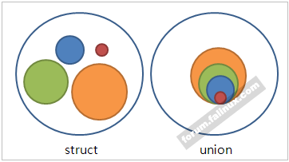

# 26. Discriminated Unions
## 들어가기 전에
### `Variant`
우리는 그간 `Tuple` 을 직접 구현해 보았다. `Tuple` 은 템플릿으로 구현된 일련의 구조체 (`struct`) 인데, 그렇다면 공용체 (`union`) 를 템플릿으로 구현한 객체는 무엇이 있을까?



```cpp
struct | union
{
    char a; // 1
    short b; // 2
    long c; // 4
    long long d; // 8
}

// sizeof(struct) = SUM(sizeof(...members)) + å
// sizeof(union) = MAX(sizeof(...members))
```

> `Variant` 가 바로 그 공용체를 템플릿으로 구현한 객체이며, 우리는 26 장에서는 바로 그 `Variant` 를 구현해 볼 것이다.


## 26.1. Storage
### Variant
제일 먼저 해야 할 것은, 데이터를 어떻게 저장하느냐다.
  - 데이터 저장소: `data_`
  - 데이터 타입: `index_`

```cpp
template <typename ...Types>
class Variant
{
private:
    Tuple<Types...> data_;
    size_t index_;
}
```

만일 데이터를 위와 같이 `Tuple` 또는 그와 유사한 모종의 구조체에 입력케 되면, 불필요한 메모리 낭비가 생기게 된다. 따라서 `struct` 가 아닌, `union` 에 기반한 데이터 저장소가 필요하다.

```cpp
//----
// STRUCT
//----
template <typename ...Types>
struct Tuple;

template <typename Head, typename ...Tail>
struct Tuple
{
private:
    Head head_;
    Tuple<Tail...> tail_;
}

template <> 
struct Tuple<> {};

//----
// UNION
//----
template <typename ...Types>
union VariantStorage;

template <typename Head, typename ...Tail>
union VariantStorage
{
private:
    Head head_;
    VariantStorage<Tail...> tail_;
}

template <> 
union VariantStorage<> {};
```

앞서의 이유로 (불필요한 메모리 낭비를 막기 위하여) `template union` 객체인 `VariantStorage` 를 만들었다. 지금 만드려는 `VariantStorage` 와, 우리가 지난 시간에 만들었던 `Tuple` 이 어떻게 다른지 보자. 

차이점이라고는 단지 `union` 을 사용했냐, `struct` 를 사용했냐 뿐이다.


## 26.2. Design
### Definitions
```cpp
template <typename ...Types>
class Variant
{
private:
    VariantStorage data_;
    size_t index_;

public:
    // CONSTRUCTORS
    Variant();
    template <typename T> Variant(const T&);

    // ACCESSORS
    template <typename T> bool is() const;
    template <typename T> auto get() const;
    template <size_t Index> auto get() const;

    // VISITOR
    template <typename Function> 
    void visit(Function&&) const;
};
```

우리가 만들 `Variant` 클래스의 인터페이스는 이와 같다.

### FindIndexOfT
```cpp
template <typename List, typename T, size_t N = 0>
struct FindIndexOfT
    : public IfThenElse<std::is_same<Front<List>, T>::value,
                        std::integral_constant<size_t, N>,
                        FindIndexOfT<PopFront<List>, T, N+1>>
{
};
```

또한, `Variant` 를 구현키 위해 새로운 종류의 템플릿 객체 `FindIndexOfT` 가 필요하다. 

`FindIndexOfT` 객체는 내가 찾고자 하는 타입 `T` 가 `TypeList` 의 몇 번째 타입에 해당하는 지 검색해준다. `FindIndexOfT` 는 `IfThenElse` 를 이용 (상속), 재귀적으로 타입 `T` 의 `index` 번호를 탐색해나간다.

### Meta Programming
`FindIndexOfT` 및 `Variant` 구현을 위해서는 몇 가지 템플릿 객체들이 필요하다. 분명 과거에 구현했던 객체들이지만, 복습하는 셈 치고 다시 한 번 더 보자.

```cpp
/* ===========================================================
    UTILITIES
        - BASE
        - ACCESSORS
        - MODIFIERS
==============================================================
    BASE
----------------------------------------------------------- */
// TYPE-LIST FOR POP
template<typename ...Elements>
class TypeList {};

// MP - IF THEN ELSE
template <bool Condition, typename TrueType, typename FalseType>
struct IfThenElseT
{
    using Type = TrueType;
};

template <typename TrueType, typename FalseType>
struct IfThenElseT<false, TrueType, FalseType>
{
    using Type = FalseType;
};

template <bool Condition, typename TrueType, typename FalseType>
using IfThenElse = typename IfThenElseT<Condition, TrueType, FalseType>::Type;

/* -----------------------------------------------------------
    ACCESSORS
----------------------------------------------------------- */
// FRONT
//----
template<typename List>
class FrontT;

template<typename Head, typename ...Tail>
class FrontT<TypeList<Head, Tail...>>
{
public:
    using Type = Head;
};

template<typename List>
using Front = typename FrontT<List>::Type;

//----
// AT
//----
template <class List, size_t index>
struct TypeAt;

template <class Head, class ...Tail>
struct TypeAt<TypeList<Head, Tail...>, 0>
{
    using Result = Head;
};

template <class Head, class ...Tail, size_t index>
struct TypeAt<TypeList<Head, Tail...>, index>
{
    using Result = typename TypeAt<TypeList<Tail...>, index - 1>::Result;
};

/* -----------------------------------------------------------
    MODIFIERS
----------------------------------------------------------- */
template<typename List>
class PopFrontT;

template<typename Head, typename... Tail>
class PopFrontT<TypeList<Head, Tail...>>
{
public:
    using Type = TypeList<Tail...>;
};

template<typename List>
using PopFront = typename PopFrontT<List>::Type;
```


## 26.3. Value Query and Extraction
### Access by `Type`
```cpp
template <typename ...Types, typename T>
bool Variant<Types...>::is() const
{
    constexpr size_t N = FindIndexOfT<TypeList<Types...>, T>::value;
    return (this->index_ == N);
}

template <typename ...Types, typename T>
auto Variant<Types...>::get() const
{
    constexpr size_t N = FindIndexOfT<TypeList<Types...>, T>::value;
    return this->get<N>();
}
```

`FindIndexOfT` 를 통하여, 타입 `T` 가 몇 번째 타입인지 알아낸 후, 해당 `index` 를 통하여 원소에 액세스 한다.

### Access by `Index`
```cpp
template <size_t Index>
struct VariantGetter
{
    template <typename Data>
    static auto apply(const Data &obj)
    {
        return VariantGetter<Index - 1>::apply(obj.tail_);
    };
};

template <>
struct VariantGetter<0>
{
    template <typename Data>
    static auto apply(const Data &obj)
    {
        return obj.head_;
    };
};

template <typename ...Types, size_t Index>
auto Variant<Types...>::get() const
{
    return VariantGetter<Index>::apply(data_);
}
```

어디서 많이 봤던 코드가 아닌가? 그렇다. `Index` 번호로 원소에 접근하는 방법은 지난 시간에 `TupleGetter` 를 구현하면서 다뤘었다. 오늘의 `VariantGetter` 는 그 때의 `TupleGetter` 코드와 정확히 같다.


## 26.4. Element Initialization, Assignment and Destruction
### `VariantStorage.hpp`
```cpp
template <typename ...Types>
union VariantStorage;

template <typename Head, typename ...Tail>
union VariantStorage<Head, Tail...>
{
public:
    Head head_;
    VariantStorage<Tail...> tail_;

public:
    // DO ITSELF
    VariantStorage() {};
    VariantStorage(const Head &head)
        : head_(head) {};

    // SHIFT RESPONSIBILITY TO TAIL
    template <typename T>
    VariantStorage(const T &val)
        : tail_(val) {};
};

template<>
union VariantStorage<>
{
};
```

`VariantStorage` 는 `Variant` 의 실질적 데이터 저장소이자 템플릿 공용체로써, 재귀적 관계를 통하여 각 타입을 저장하고 있다. 

할당받은 데이터의 타입이 `Head` 이거든 현재의 객체에 할당하며, `Head` 가 아닌 그 외의 다른 타입이거든 (`T`), 자식 객체 (`VariantStorage<Tail...> tail_) 에게 데이터 할당의 역할을 넘긴다.

### `Variant.hpp`
```cpp
template <typename ...Types>
class Variant
{
private:
    VariantStorage<Types...> data_;
    size_t index_;

public:
    // DEFAULT CONSTRUCTOR - UNDEFINED
    Variant()
        : index_(-1) {};

    // ASSIGN CONSTRUCTOR - SPECIFIC TYPE & VALUE
    template <typename T>
    Variant(const T &val)
        : data_(val), 
        index_(FindIndexOfT<Typelist<Types...>, T>::value)
    {
    };
};
```

실질적인 데이터 저장은 `VariantStorage` 가 하고 있다. 고로, *Assign Constructor* 를 통해 객체가 생성되거든, 할당받은 데이터를 `VariantStorage` 에 넘겨주며, `FindIndexOfT` 를 통하여 현재 할당받은 데이터의 타입 `T` 가 몇 번째 타입인 지 기록해두자.


## 26.5. Visitors
```cpp
template <typename ...Types>
class Variant
{
public:
    template <typename Func>
    void visit(Func &&func) const
    {
        if (index_ == -1)
            throw std::invalid_argument("value is not assigned.");

        _Visit<Func, Types...>(&func);
    };

private:
    template <typename Func, typename Head, typename ...Tail>
    void _Visit(Func *func) const
    {
        if (is<Head>())
            (*func)(get<Head>());
        else if constexpr (sizeof...(Tail) > 0)
            _Visit<Func, Tail...>(func);
    };
};
```


## 26.6. Variant Initialization and Assignment
Nothing to do
